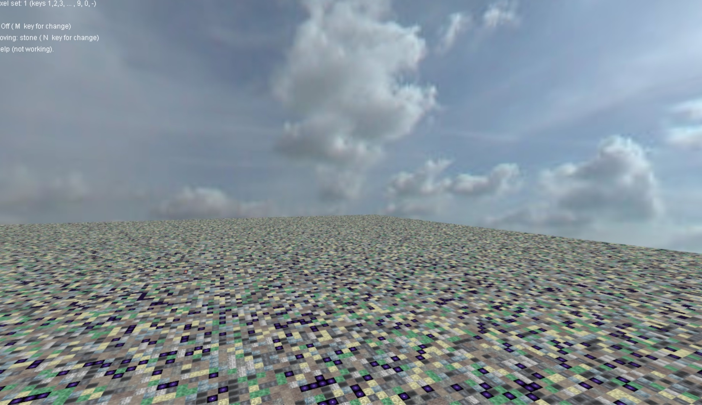
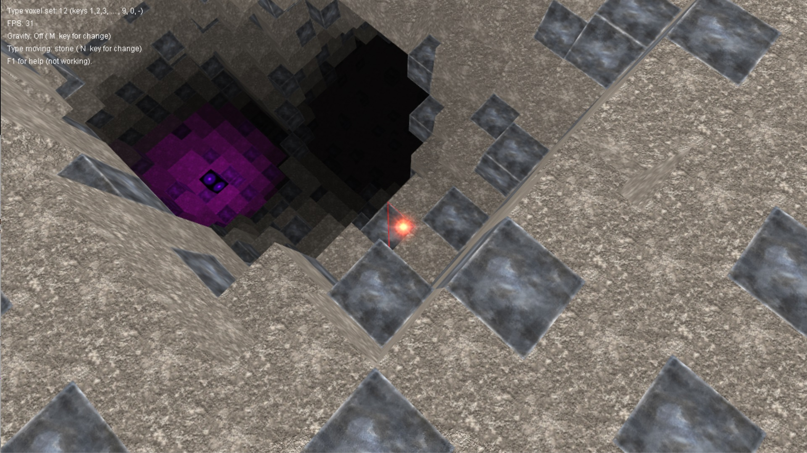
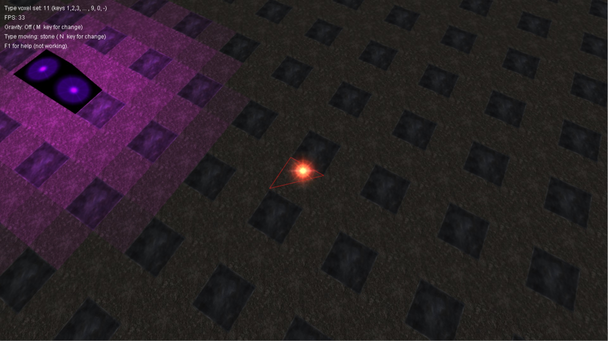
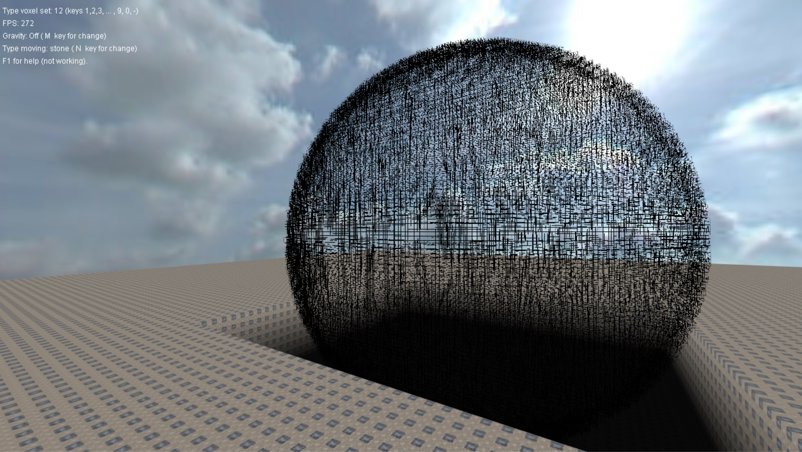
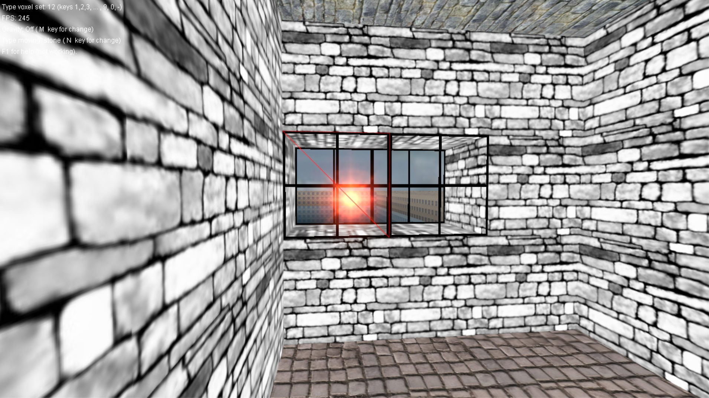
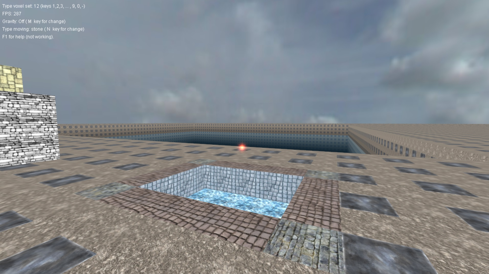

# SimpleVoxelEngine
SimpleVoxelEngine and IrrSimpleVoxelEngine. FPS on screenshots sometimes incorrect due to taking screenshots (the game would lose focus and stop working). On the first screenshot, about 80 FPS, on the second and third 300-400 FPS. On the rest I did it through a print screen, so the FPS is correct.

 

